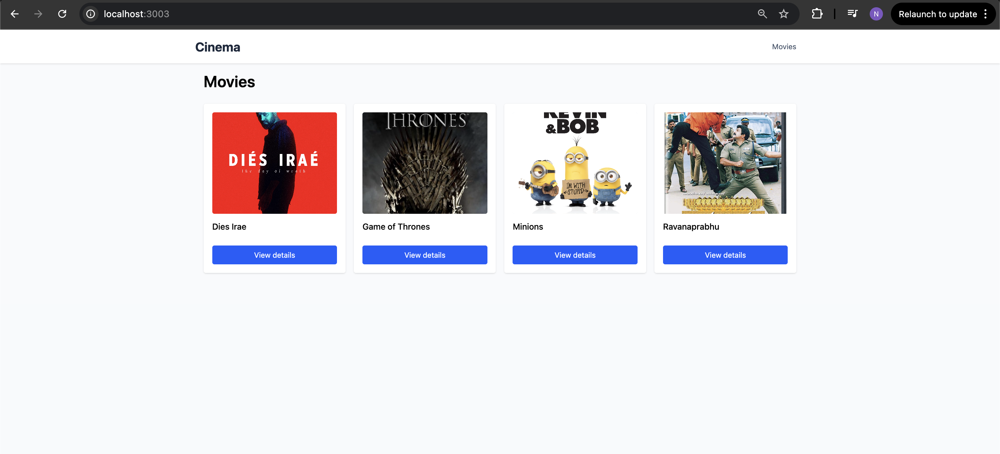

# Flintech software services - assignment

## Seat Booking App (React + TypeScript)



## Tech Stack

| Layer | Tech |
|-------|------|
| Framework | **React 19 + TypeScript + Vite** |
| Styling | **Tailwind CSS** |
| State Management | **Zustand** |
| Routing | **React Router v7** |
| Notifications | **React Hot Toast** |
| Testing | **Jest + React Testing Library** |
| Code Quality | **ESLint + Prettier + Husky (pre-commit)** |

---

## User Flow

1. **Movies Page** – Displays a grid of movies.  
   ➜ Click **“View Details”** to open a specific movie.

2. **Movie Details Page** – Shows movie info and two theatres (ABC / XYZ).  
   ➜ Click **“Select Seats”** for a chosen theatre.

3. **Seat Selection Page** – Interactive seat grid:
   - Seats labeled (A1–J10), grouped by tier:
     -  Silver ₹100  
     -  Gold ₹150  
     -  Platinum ₹200
   - Click to **select / deselect** (max 8 seats).
   - Disabled (booked) seats are unclickable.
   - Real-time total updates in the summary.
   - Press **“Book Now”** → Confirm → Seats marked as booked.
   - Toast notifications for success/error.

4. **Testing**
   - Covers seat selection, max-8 rule, and booking flow.

## How to Run

```bash
# Install dependencies
npm install

# Start dev server
npm run dev

# Run tests
npm test

# Run with lint before commit (Husky pre-commit)
npm run prepare
```

### Features Implemented

- Responsiveness
- Unit testing
- Accessibility
- Husky pre-commit hook for tests
- Persistance over refresh using zustand. 
- Toast notification

